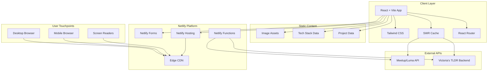

# Product Requirements Document
## Victoria Lauri Portfolio Website

**Version:** 1.0  
**Date:** December 1, 2025  
**Author:** AI Assistant  
**Status:** Draft

---

## 1. Executive Summary

### Primary Value Propositions

1. **Professional Credibility Engine:** Establishes Victoria as a capable, modern full-stack developer through demonstrated technical depth and polished presentation.
2. **Dual-Purpose Lead Generation:** Serves both freelance client acquisition and technical recruiter engagement with tailored content pathways.
3. **Living Technical Showcase:** Dynamic API integrations (TLDR newsletter, Meetup/Luma events) demonstrate real-world engineering skills beyond static portfolio pieces.
4. **Accessibility-First Differentiation:** WCAG AA compliance and inclusive design principles reflect Victoria's values and technical attention to detail.
5. **Community Engagement Hub:** Events integration positions Victoria as an active participant in the tech ecosystem.

### Strategic Alignment

This portfolio directly supports Victoria's career transition from linguistics and real estate into software engineering by:
- Providing tangible proof of technical capabilities to hiring managers
- Creating a professional touchpoint for freelance business development
- Demonstrating commitment to modern web standards and best practices
- Showcasing problem-solving abilities through detailed project breakdowns

### Core Benefits

- **For Recruiters:** Quick skill assessment, easy navigation to relevant projects, clear contact pathway
- **For Freelance Clients:** Service clarity, portfolio evidence, professional credibility signals
- **For Victoria:** Automated content updates reduce maintenance burden, professional online presence, interview conversation starter

### Success Definition

The portfolio succeeds when it:
- Generates measurable freelance inquiries via the contact form
- Receives positive recruiter feedback on technical depth and presentation
- Achieves 90+ Lighthouse scores across all categories
- Demonstrates API integration proficiency to technical evaluators

---

## 2. Scope Definition

### In Scope

1. **Multi-page React/Vite application** with TypeScript and Tailwind CSS
2. **Six core pages:** Home, About, Projects, Project Detail (dynamic), News (TLDR), Events, Contact
3. **TLDR Newsletter API integration** with category tabs and daily refresh
4. **Meetup/Luma Events API integration** with location filtering
5. **Netlify Forms contact submission** with validation and privacy notice
6. **Responsive design** optimized for mobile, tablet, and desktop viewports
7. **WCAG AA accessibility compliance** including keyboard navigation and screen reader support
8. **SEO optimization** with meta tags, OpenGraph images, sitemap, and robots.txt

### Out of Scope

1. **User authentication/accounts** — no login required for portfolio viewing
2. **CMS or admin dashboard** — content managed via code and API integrations
3. **E-commerce or payment processing** — portfolio only, no transactions
4. **Blog with commenting system** — News page is read-only API aggregation
5. **Multi-language support** — English only for initial release

### Future Considerations (Phase 2+)

- GitHub API integration for contribution statistics and activity feed
- Dark mode toggle with system preference detection
- Analytics dashboard for tracking portfolio engagement
- Testimonials section with client/colleague quotes
- Case study video embeds for select projects
- RSS feed for News page content

---

## 3. Target Market & User Analysis

### 3.1 Ideal Customer Profile (ICP)

#### For Freelance Clients
- **Company Characteristics:** Startups (seed to Series A), small agencies, solo founders; 1–50 employees; UK-based or remote-friendly
- **Technology Profile:** Need modern web presence, MVP development, or React-based applications; comfortable with technical discussions
- **Business Context:** Limited internal dev resources, need external expertise for web projects; budget range £2,000–£15,000 per project
- **Success Criteria:** Delivered, functional web application within timeline and budget; clean code handoff

#### For Employment Opportunities
- **Company Characteristics:** Tech companies, digital agencies, product-focused startups; London or remote positions
- **Technology Profile:** React/TypeScript stack, modern CI/CD practices, agile methodologies
- **Business Context:** Hiring junior to mid-level full-stack engineers; value diverse backgrounds and strong fundamentals
- **Success Criteria:** Candidate demonstrates technical capability, problem-solving skills, and cultural fit

### 3.2 User Personas

#### Persona 1: Technical Recruiter (Primary)

- **Demographics & Role:** HR/Talent Acquisition, 3–7 years experience, screens 50+ candidates weekly
- **Goals & Motivations:** Quickly assess candidate fit, find evidence of claimed skills, reduce time-to-shortlist
- **Pain Points:** Generic portfolios, unclear skill levels, missing contact information, slow-loading sites
- **Technical Proficiency:** Moderate — understands tech terminology but not code-level details
- **Usage Patterns:** Spends 2–5 minutes per portfolio; scans hero, skims projects, checks contact
- **Decision Influence:** Gatekeeper — determines if candidate reaches hiring manager

#### Persona 2: Engineering Hiring Manager (Primary)

- **Demographics & Role:** Senior/Lead Developer or Engineering Manager, 5–15 years experience, makes final hiring decisions
- **Goals & Motivations:** Evaluate technical depth, assess code quality and architecture thinking, find team fit
- **Pain Points:** Surface-level portfolios without technical substance, no GitHub links, vague project descriptions
- **Technical Proficiency:** High — reads code, evaluates architecture decisions, understands trade-offs
- **Usage Patterns:** Spends 5–15 minutes if interested; deep-dives into project details, checks GitHub
- **Decision Influence:** Decision maker — determines hire/no-hire

#### Persona 3: Startup Founder (Secondary)

- **Demographics & Role:** Non-technical or semi-technical founder, building MVP or company website
- **Goals & Motivations:** Find reliable developer, understand capabilities and fit, get project started quickly
- **Pain Points:** Difficulty evaluating technical quality, fear of overcharging or under-delivery
- **Technical Proficiency:** Low to moderate — understands outcomes but not implementation
- **Usage Patterns:** Browses services, reviews past work, seeks trust signals
- **Decision Influence:** Budget holder — makes freelance engagement decisions

#### Persona 4: Tech Community Peer (Tertiary)

- **Demographics & Role:** Fellow developer, meetup attendee, potential collaborator
- **Goals & Motivations:** Network, learn about Victoria's work, find common interests
- **Pain Points:** Difficulty finding relevant people in the community
- **Technical Proficiency:** High — evaluates work as a peer
- **Usage Patterns:** Discovers via events page or social links, explores projects
- **Decision Influence:** Referral source — may recommend Victoria to their network

---

## 4. User Stories & Acceptance Criteria

### 4.1 Core User Stories

#### Recruiter Stories
- **US-R1:** As a recruiter, I want to quickly understand Victoria's skills and experience so that I can assess candidate fit within 2 minutes.
- **US-R2:** As a recruiter, I want to easily find contact information so that I can reach out for an interview.
- **US-R3:** As a recruiter, I want to see relevant projects so that I can evaluate practical experience.

#### Hiring Manager Stories
- **US-H1:** As a hiring manager, I want to view detailed project breakdowns so that I can assess technical decision-making.
- **US-H2:** As a hiring manager, I want to access GitHub repositories so that I can review code quality.
- **US-H3:** As a hiring manager, I want to understand the challenges faced and solutions implemented so that I can evaluate problem-solving ability.

#### Freelance Client Stories
- **US-F1:** As a potential client, I want to understand services offered so that I can determine if Victoria can help with my project.
- **US-F2:** As a potential client, I want to submit a project inquiry so that I can start a conversation about my needs.
- **US-F3:** As a potential client, I want to see examples of past work so that I can trust the quality of deliverables.

#### General User Stories
- **US-G1:** As a visitor, I want the site to load quickly so that I don't abandon before seeing content.
- **US-G2:** As a visitor with disabilities, I want the site to be accessible so that I can navigate and read content effectively.
- **US-G3:** As a mobile user, I want the site to work well on my phone so that I can browse while commuting.

### 4.2 Detailed User Flows

#### Primary Workflow 1: Recruiter Assessment Flow

1. User lands on Home page via LinkedIn link
2. Reads hero section — understands role and value proposition (< 30 seconds)
3. Scans services summary — confirms relevant tech stack
4. Clicks "View Projects" CTA
5. Browses project grid — identifies relevant experience
6. Clicks into 1–2 project detail pages
7. Reviews technical breakdown and GitHub link
8. Returns to navigation, clicks "Contact"
9. Submits inquiry or notes email for outreach

**Acceptance Criteria:**
- [ ] Hero section loads above fold within 1 second
- [ ] Value proposition is clear within 10 words
- [ ] Projects CTA is visible without scrolling on desktop
- [ ] Project grid displays within 500ms of navigation
- [ ] Contact form submits successfully with confirmation message

#### Primary Workflow 2: Technical Deep-Dive Flow

1. User arrives at Projects page (direct link or navigation)
2. Scans project cards for relevant technology tags
3. Clicks into project matching their evaluation criteria
4. Reads problem statement and solution overview
5. Reviews technical breakdown section
6. Clicks GitHub link to examine code
7. Returns to portfolio, reviews "Challenges & Decisions" section
8. Notes portfolio for follow-up interview questions

**Acceptance Criteria:**
- [ ] Tech stack tags are visible on project cards
- [ ] Project detail page loads within 1 second
- [ ] GitHub link opens in new tab
- [ ] Technical breakdown uses clear headings and code snippets where relevant
- [ ] Back navigation preserves scroll position on Projects page

#### Primary Workflow 3: News Discovery Flow

1. User navigates to News page
2. Views latest TLDR newsletter content
3. Clicks category tab (Web Dev, AI, Security, etc.)
4. Browses filtered articles
5. Clicks article link to read full content on TLDR
6. Returns to News page for more browsing

**Acceptance Criteria:**
- [ ] News content loads within 2 seconds
- [ ] Category tabs are keyboard accessible
- [ ] Active tab state is visually distinct
- [ ] Article links open in new tab
- [ ] Content refreshes daily automatically

#### Edge Cases & Error Handling

- **API Failure (News):** Display cached content with "Last updated" timestamp; show friendly error if no cache exists
- **API Failure (Events):** Show "Events temporarily unavailable" message with manual refresh button
- **Form Validation:** Inline error messages for invalid email, empty required fields
- **404 Routes:** Custom 404 page with navigation back to Home
- **Slow Connection:** Skeleton loaders for dynamic content areas

---

## 5. Feature Specifications

### 5.1 Feature Hierarchy

| Feature | Priority | Complexity | User Value | Business Value |
|---------|----------|------------|------------|----------------|
| Home Page | Critical | Moderate | High | High |
| Projects Grid | Critical | Moderate | High | High |
| Project Detail Template | Critical | Complex | High | High |
| Contact Form | Critical | Simple | High | High |
| About Page | High | Simple | Medium | High |
| News (TLDR) Integration | High | Complex | Medium | High |
| Events Integration | Medium | Complex | Medium | Medium |
| Responsive Design | Critical | Moderate | High | High |
| Accessibility (WCAG AA) | Critical | Moderate | High | Medium |
| SEO Optimization | High | Simple | Low | High |

### 5.2 Detailed Requirements

#### 5.2.1 Home Page

**Functional Specifications:**
- Hero section with name, title, and value proposition tagline
- Services summary (3 cards): Frontend, Full-Stack, Web Apps
- Tech stack mentions: JavaScript, React, Node.js, SQL
- Featured projects teaser (2–3 static cards, not carousel)
- Dual CTAs: "View Projects" and "Contact Me"

**User Interface Requirements:**
- Hero image or abstract graphic background
- Responsive layout: single column on mobile, multi-column on desktop
- Subtle entrance animations (fade-in, slide-up) respecting `prefers-reduced-motion`
- Minimum touch target size: 44x44px for CTAs

**Performance Requirements:**
- Largest Contentful Paint (LCP) < 2.5s
- First Input Delay (FID) < 100ms
- Cumulative Layout Shift (CLS) < 0.1

#### 5.2.2 About Page

**Functional Specifications:**
- Personal narrative: linguistics → real estate → software engineering journey
- Mission statement: "Empowering minds of all kinds through tech"
- Tech stack visual grid with icons/logos
- Soft skills section highlighting cross-disciplinary strengths
- Social links: GitHub, LinkedIn
- Optional professional headshot

**Data Requirements:**
- Static content, manually maintained
- Tech stack data as structured array for easy updates

#### 5.2.3 Projects Page

**Functional Specifications:**
- Grid layout displaying up to 6 project cards
- Each card shows: title, description (2–3 lines), thumbnail, tech tags
- Click navigates to project detail page
- Keyboard navigation between cards

**User Interface Requirements:**
- 3-column grid on desktop, 2-column on tablet, 1-column on mobile
- Card hover state with subtle elevation/shadow
- Tech tags as pill-style badges
- Lazy-loaded thumbnail images

**Data Requirements:**
- Project data stored as TypeScript objects/JSON
- Image assets optimized and served from `/public/assets/projects/`

#### 5.2.4 Project Detail Page Template

**Functional Specifications:**
- Dynamic routing: `/projects/:slug`
- Hero image/screenshot (full-width or contained)
- Sections:
  - Overview (Problem → Solution)
  - Technical Breakdown (architecture, tools, APIs, logic)
  - Features List
  - Challenges & Decisions
  - Key Learnings
- Links: GitHub repository, Live demo (if available)
- "Back to Projects" navigation

**User Interface Requirements:**
- Consistent layout across all project pages
- Code snippets with syntax highlighting where relevant
- Responsive images with `srcset` for multiple resolutions
- Sticky "Back to top" button on long pages

**Data Requirements:**
- Markdown or structured data for project content
- Metadata: title, slug, description, tech stack, links, images

#### 5.2.5 News Page (TLDR Integration)

**Functional Specifications:**
- Fetches content from Victoria's TLDR backend endpoint
- Category tabs: Web Dev, AI, Security, DevOps, etc.
- Daily auto-refresh with manual refresh option
- Article cards: headline, source, summary snippet, link
- "Powered by TLDR" attribution

**User Interface Requirements:**
- Tab bar with horizontal scroll on mobile
- Card-based article layout
- Loading skeleton during fetch
- Error state with retry button

**Integration Points:**
- Custom backend API endpoint (already exists)
- Response caching with SWR/React Query
- Stale-while-revalidate pattern

**Business Rules:**
- Cache TTL: 24 hours
- Fallback to cache on API failure
- Maximum 20 articles per category display

#### 5.2.6 Events Page

**Functional Specifications:**
- Fetches tech events from Meetup or Luma API
- Event cards: name, date/time, format (online/in-person), location, link
- Filters: "All", "Online", "London-based"
- Sort by date (soonest first)

**User Interface Requirements:**
- Filter buttons or dropdown
- Calendar-style date display
- Location badge (virtual icon vs. pin icon)
- Empty state: "No upcoming events"

**Integration Points:**
- Meetup GraphQL API or Luma public API
- API key stored in environment variables
- Server-side or edge function to hide API keys

**Business Rules:**
- Display events within next 30 days
- Maximum 12 events displayed
- Refresh on page visit (with cache)

#### 5.2.7 Contact Page

**Functional Specifications:**
- Form fields: Name (required), Email (required), Message (required)
- Netlify Forms integration for submission handling
- Success confirmation message
- Privacy notice about data usage
- Alternative contact: social links

**User Interface Requirements:**
- Single-column centered form
- Inline validation with error messages
- Submit button with loading state
- Success state replaces form

**Data Requirements:**
- Form submissions stored in Netlify dashboard
- Email notifications to Victoria

**Business Rules:**
- Email validation: standard format check
- Message minimum: 10 characters
- Honeypot field for spam prevention

---

## 6. Technical Architecture & Implementation

### 6.1 Technology Stack & Architecture Decision

| Layer | Technology | Rationale |
|-------|------------|-----------|
| **Frontend Framework** | React 18 + Vite | Fast build times, modern DX, excellent TypeScript support, client brief requirement |
| **Language** | TypeScript | Type safety, better IDE support, catches errors early |
| **Styling** | Tailwind CSS | Utility-first approach, consistent design tokens, responsive utilities, client brief requirement |
| **Routing** | React Router v6 | Standard React routing, supports dynamic routes for projects |
| **Data Fetching** | SWR | Lightweight, built-in caching, stale-while-revalidate pattern |
| **Forms** | Netlify Forms | Zero-config form handling, spam protection, client brief requirement |
| **Hosting** | Netlify | Client brief requirement, excellent Vite support, edge functions available |
| **Code Quality** | ESLint + Prettier | Consistent code style, catch common errors |
| **Testing** | Vitest + React Testing Library | Fast unit tests, accessibility testing support |

### 6.2 Application Scaffolding & Structure

```plaintext
victorialauri-portfolio/
├── README.md
├── package.json
├── tsconfig.json
├── vite.config.ts
├── tailwind.config.ts
├── postcss.config.js
├── eslint.config.js
├── .prettierrc
├── .env.example
├── .gitignore
├── netlify.toml
├── public/
│   ├── favicon.ico
│   ├── og-image.png
│   ├── robots.txt
│   ├── sitemap.xml
│   └── assets/
│       ├── images/
│       │   ├── hero-bg.webp
│       │   ├── headshot.webp
│       │   └── tech-icons/
│       └── projects/
│           ├── project-1-thumb.webp
│           ├── project-1-hero.webp
│           └── ...
├── src/
│   ├── main.tsx
│   ├── App.tsx
│   ├── index.css
│   ├── vite-env.d.ts
│   ├── components/
│   │   ├── ui/
│   │   │   ├── Button.tsx
│   │   │   ├── Card.tsx
│   │   │   ├── Badge.tsx
│   │   │   ├── Input.tsx
│   │   │   ├── Textarea.tsx
│   │   │   ├── Tabs.tsx
│   │   │   ├── Skeleton.tsx
│   │   │   ├── ErrorMessage.tsx
│   │   │   └── index.ts
│   │   ├── layout/
│   │   │   ├── Header.tsx
│   │   │   ├── Footer.tsx
│   │   │   ├── Navigation.tsx
│   │   │   ├── MobileMenu.tsx
│   │   │   ├── SkipLink.tsx
│   │   │   ├── Layout.tsx
│   │   │   └── index.ts
│   │   ├── home/
│   │   │   ├── Hero.tsx
│   │   │   ├── ServicesSection.tsx
│   │   │   ├── FeaturedProjects.tsx
│   │   │   └── index.ts
│   │   ├── about/
│   │   │   ├── Journey.tsx
│   │   │   ├── TechStack.tsx
│   │   │   ├── SoftSkills.tsx
│   │   │   └── index.ts
│   │   ├── projects/
│   │   │   ├── ProjectCard.tsx
│   │   │   ├── ProjectGrid.tsx
│   │   │   ├── ProjectHero.tsx
│   │   │   ├── ProjectOverview.tsx
│   │   │   ├── TechnicalBreakdown.tsx
│   │   │   ├── ChallengesSection.tsx
│   │   │   └── index.ts
│   │   ├── news/
│   │   │   ├── NewsCard.tsx
│   │   │   ├── NewsList.tsx
│   │   │   ├── CategoryTabs.tsx
│   │   │   └── index.ts
│   │   ├── events/
│   │   │   ├── EventCard.tsx
│   │   │   ├── EventList.tsx
│   │   │   ├── EventFilters.tsx
│   │   │   └── index.ts
│   │   └── contact/
│   │       ├── ContactForm.tsx
│   │       ├── SocialLinks.tsx
│   │       └── index.ts
│   ├── pages/
│   │   ├── HomePage.tsx
│   │   ├── AboutPage.tsx
│   │   ├── ProjectsPage.tsx
│   │   ├── ProjectDetailPage.tsx
│   │   ├── NewsPage.tsx
│   │   ├── EventsPage.tsx
│   │   ├── ContactPage.tsx
│   │   └── NotFoundPage.tsx
│   ├── lib/
│   │   ├── api/
│   │   │   ├── tldr.ts
│   │   │   ├── events.ts
│   │   │   └── index.ts
│   │   ├── hooks/
│   │   │   ├── useNews.ts
│   │   │   ├── useEvents.ts
│   │   │   ├── useMediaQuery.ts
│   │   │   ├── useReducedMotion.ts
│   │   │   └── index.ts
│   │   └── utils/
│   │       ├── cn.ts
│   │       ├── formatDate.ts
│   │       ├── seo.ts
│   │       └── index.ts
│   ├── data/
│   │   ├── projects.ts
│   │   ├── techStack.ts
│   │   ├── services.ts
│   │   └── navigation.ts
│   ├── types/
│   │   ├── project.ts
│   │   ├── news.ts
│   │   ├── event.ts
│   │   └── index.ts
│   └── styles/
│       └── globals.css
├── tests/
│   ├── setup.ts
│   ├── components/
│   └── pages/
└── docs/
    └── api-integration.md
```

### 6.3 Data Structures

Since this is primarily a static portfolio with API integrations, there's no traditional database. Data is structured as TypeScript objects:

```typescript
// types/project.ts
export interface Project {
  id: string;
  slug: string;
  title: string;
  shortDescription: string;
  fullDescription: string;
  thumbnail: string;
  heroImage: string;
  techStack: string[];
  features: string[];
  challenges: ChallengeItem[];
  learnings: string[];
  githubUrl: string;
  liveUrl?: string;
  featured: boolean;
  order: number;
}

export interface ChallengeItem {
  challenge: string;
  solution: string;
}

// types/news.ts
export interface NewsArticle {
  id: string;
  title: string;
  source: string;
  summary: string;
  url: string;
  category: NewsCategory;
  publishedAt: string;
}

export type NewsCategory = 
  | 'webdev' 
  | 'ai' 
  | 'security' 
  | 'devops' 
  | 'general';

// types/event.ts
export interface TechEvent {
  id: string;
  name: string;
  description: string;
  dateTime: string;
  endDateTime?: string;
  format: 'online' | 'in-person' | 'hybrid';
  location?: string;
  url: string;
  organizer: string;
}
```

### 6.4 API Design & Endpoints

#### External API Integrations

**TLDR Newsletter API (Victoria's Backend)**
```
GET /api/tldr/articles
Query Params:
  - category: string (optional, default: 'all')
  - limit: number (optional, default: 20)

Response:
{
  "articles": NewsArticle[],
  "lastUpdated": "2025-12-01T00:00:00Z",
  "categories": string[]
}
```

**Meetup/Luma Events API**
```
GET /api/events
Query Params:
  - format: 'all' | 'online' | 'in-person' (optional)
  - limit: number (optional, default: 12)

Response:
{
  "events": TechEvent[],
  "total": number
}
```

#### Netlify Functions (if needed for API proxying)

```
netlify/functions/
├── tldr-proxy.ts      # Proxy TLDR API calls
└── events-proxy.ts    # Proxy Meetup/Luma API with key hiding
```

### 6.5 System Architecture Diagram



---

## 7. Detailed Task Breakdown & Planning

### 7.1 Development Tasks by Category

#### Infrastructure & Setup Tasks

| ID | Task | Description | Effort | Priority | Dependencies |
|----|------|-------------|--------|----------|--------------|
| INF-01 | Project scaffolding | Initialize Vite + React + TypeScript project | S | Critical | None |
| INF-02 | Tailwind configuration | Set up Tailwind with custom theme tokens | S | Critical | INF-01 |
| INF-03 | ESLint + Prettier setup | Configure linting and formatting rules | XS | High | INF-01 |
| INF-04 | React Router setup | Configure routing structure | S | Critical | INF-01 |
| INF-05 | Netlify configuration | Create netlify.toml, configure builds | S | High | INF-01 |
| INF-06 | Environment variables | Set up .env structure for API keys | XS | High | INF-01 |
| INF-07 | Testing setup | Configure Vitest + RTL | S | Medium | INF-01 |

#### Frontend Development Tasks — Layout & UI

| ID | Task | Description | Effort | Priority | Dependencies |
|----|------|-------------|--------|----------|--------------|
| UI-01 | Design system foundation | Create base UI components (Button, Card, Badge, Input) | M | Critical | INF-02 |
| UI-02 | Header component | Responsive header with navigation | M | Critical | UI-01 |
| UI-03 | Footer component | Footer with social links and copyright | S | High | UI-01 |
| UI-04 | Mobile navigation | Hamburger menu with accessible drawer | M | Critical | UI-02 |
| UI-05 | Skip link | "Skip to content" accessibility feature | XS | High | UI-02 |
| UI-06 | Layout wrapper | Shared layout component with header/footer | S | Critical | UI-02, UI-03 |
| UI-07 | Skeleton loaders | Loading states for dynamic content | S | Medium | UI-01 |
| UI-08 | Error states | Error message components | S | Medium | UI-01 |

#### Frontend Development Tasks — Pages

| ID | Task | Description | Effort | Priority | Dependencies |
|----|------|-------------|--------|----------|--------------|
| PG-01 | Home page | Hero, services, featured projects | L | Critical | UI-06 |
| PG-02 | About page | Journey, tech stack, soft skills | M | High | UI-06 |
| PG-03 | Projects page | Project grid with cards | M | Critical | UI-06, DATA-01 |
| PG-04 | Project detail template | Dynamic project pages | L | Critical | PG-03 |
| PG-05 | News page | TLDR integration with tabs | L | High | UI-06, API-01 |
| PG-06 | Events page | Events integration with filters | L | Medium | UI-06, API-02 |
| PG-07 | Contact page | Form with Netlify integration | M | Critical | UI-06 |
| PG-08 | 404 page | Custom not found page | S | Medium | UI-06 |

#### Data & Content Tasks

| ID | Task | Description | Effort | Priority | Dependencies |
|----|------|-------------|--------|----------|--------------|
| DATA-01 | Project data structure | Create TypeScript types and initial data | M | Critical | INF-01 |
| DATA-02 | Tech stack data | Icons and labels for tech stack display | S | High | INF-01 |
| DATA-03 | Navigation data | Route definitions and labels | XS | High | INF-04 |
| DATA-04 | Project content | Write detailed content for 3-6 projects | L | Critical | DATA-01 |
| DATA-05 | About page content | Personal narrative and mission | M | High | None |
| DATA-06 | Image assets | Optimize and prepare all images | M | High | None |

#### API Integration Tasks

| ID | Task | Description | Effort | Priority | Dependencies |
|----|------|-------------|--------|----------|--------------|
| API-01 | TLDR API integration | Fetch hook with SWR, caching | M | High | INF-06 |
| API-02 | Events API integration | Meetup/Luma fetch with filtering | M | Medium | INF-06 |
| API-03 | Netlify Forms setup | Form handling configuration | S | Critical | PG-07 |
| API-04 | Error handling | Graceful API failure handling | S | High | API-01, API-02 |

#### Accessibility Tasks

| ID | Task | Description | Effort | Priority | Dependencies |
|----|------|-------------|--------|----------|--------------|
| A11Y-01 | Semantic HTML audit | Ensure proper heading hierarchy, landmarks | S | Critical | All PG tasks |
| A11Y-02 | Keyboard navigation | Tab order, focus management | M | Critical | All PG tasks |
| A11Y-03 | Focus indicators | Visible, high-contrast focus styles | S | Critical | UI-01 |
| A11Y-04 | Screen reader testing | ARIA labels, alt text, announcements | M | Critical | All PG tasks |
| A11Y-05 | Reduced motion | Respect prefers-reduced-motion | S | High | All animations |
| A11Y-06 | Color contrast | Verify WCAG AA contrast ratios | S | Critical | INF-02 |

#### SEO & Performance Tasks

| ID | Task | Description | Effort | Priority | Dependencies |
|----|------|-------------|--------|----------|--------------|
| SEO-01 | Meta tags | Title, description per page | S | High | All PG tasks |
| SEO-02 | OpenGraph tags | Social sharing metadata | S | High | SEO-01 |
| SEO-03 | Sitemap generation | Create sitemap.xml | S | Medium | INF-04 |
| SEO-04 | robots.txt | Search engine directives | XS | Medium | None |
| PERF-01 | Image optimization | WebP conversion, srcset | M | High | DATA-06 |
| PERF-02 | Code splitting | Route-based lazy loading | S | Medium | All PG tasks |
| PERF-03 | Lighthouse audit | Achieve 90+ scores | M | High | All tasks |

### 7.2 Impact–Effort Matrix Analysis

#### Quick Wins (High Impact, Low Effort)
- **INF-01–03:** Project scaffolding sets foundation for all work
- **UI-05:** Skip link is minimal code, high accessibility impact
- **SEO-04:** robots.txt is copy-paste, enables search indexing
- **A11Y-03:** Focus indicators are CSS-only, critical for keyboard users

#### Major Projects (High Impact, High Effort)
- **PG-04:** Project detail template is core value proposition
- **API-01:** TLDR integration demonstrates technical capability
- **DATA-04:** Project content requires writing and screenshots
- **PERF-03:** Lighthouse optimization may require multiple iterations

#### Fill-In Tasks (Low Impact, Low Effort)
- **PG-08:** 404 page is simple but improves UX
- **UI-07:** Skeleton loaders are nice polish
- **SEO-03:** Sitemap helps but isn't critical for small site

#### Avoid/Reassess (Low Impact, High Effort)
- **API-02 (Events):** Consider simplified version or Phase 2 if timeline is tight
- GitHub API integration (future consideration)

---

## 8. Implementation Roadmap

### 8.1 Phase Planning

#### Phase 1: Foundation (MVP) — Weeks 1–3

**Duration:** 3 weeks  
**Focus:** Core portfolio functionality

**Deliverables:**
1. Project infrastructure and tooling
2. Layout components (Header, Footer, Navigation)
3. Home page with hero and services
4. About page with journey and tech stack
5. Projects page with grid
6. Project detail page template (2–3 projects)
7. Contact page with Netlify Forms
8. Basic responsive design
9. Core accessibility features

**Success Criteria:**
- [ ] All core pages render and navigate correctly
- [ ] Contact form submits successfully
- [ ] Site deploys to Netlify
- [ ] Lighthouse Performance > 80
- [ ] No critical accessibility violations

**Resource Requirements:**
- 1 developer (Victoria)
- Design assets (can use placeholders initially)
- Netlify account

#### Phase 2: API Integration & Polish — Weeks 4–5

**Duration:** 2 weeks  
**Focus:** Dynamic content and refinement

**Deliverables:**
1. TLDR News page with category tabs
2. Events page with Meetup/Luma integration
3. All project detail pages completed (3–6 total)
4. Animation polish (entrance animations, hover states)
5. Full accessibility audit and fixes
6. SEO optimization (meta tags, OpenGraph)
7. Performance optimization

**Success Criteria:**
- [ ] News page displays live TLDR content
- [ ] Events page displays upcoming events
- [ ] All Lighthouse scores > 90
- [ ] WCAG AA compliance verified
- [ ] All project content complete

#### Phase 3: Launch & Iterate — Week 6+

**Duration:** 1 week + ongoing  
**Focus:** Launch and feedback incorporation

**Deliverables:**
1. Final content review and polish
2. Custom domain configuration
3. Analytics setup (if desired)
4. Launch announcement
5. Gather feedback and iterate

**Success Criteria:**
- [ ] Site live on custom domain
- [ ] Shared with target audience (recruiters, clients)
- [ ] Initial feedback collected
- [ ] Bug fixes deployed within 48 hours

### 8.2 Risk Management & Dependencies

#### Technical Risks

| Risk | Likelihood | Impact | Mitigation |
|------|------------|--------|------------|
| TLDR API unavailable/changes | Medium | Medium | Cache content, manual fallback data |
| Meetup/Luma API access issues | Medium | Low | Events page is P2, can defer |
| Lighthouse score challenges | Medium | Medium | Budget time for optimization |
| Image performance issues | Low | Medium | Use WebP, lazy loading, CDN |

#### External Dependencies

- **Victoria's TLDR Backend:** Must be operational for News page
- **Meetup/Luma API:** Requires API key or scraping approach
- **Netlify:** Platform availability (99.9% SLA)
- **Content:** Project descriptions and images from Victoria

#### Contingency Plans

- **If TLDR API fails:** Display static curated links with "API integration demo" note
- **If Events API problematic:** Replace with manual event list or defer to Phase 3
- **If timeline slips:** Prioritize Home, Projects, Contact; defer News/Events

---

## 9. Success Metrics & KPIs

### 9.1 Business Metrics

| Metric | Baseline | Target (3 months) | Target (6 months) |
|--------|----------|-------------------|-------------------|
| Freelance inquiries via contact form | 0 | 3+ | 6+ |
| Interview invitations | N/A | 5+ | 10+ |
| Portfolio mentions in interviews | 0% | 50% | 80% |
| Recruiter positive feedback | N/A | "Stands out" comments | Referrals |

### 9.2 Product & User Metrics

| Metric | Target |
|--------|--------|
| Average session duration | > 2 minutes |
| Pages per session | > 3 |
| Project detail page views | > 40% of sessions |
| Contact form completion rate | > 5% of visitors |
| Bounce rate | < 50% |
| Return visitor rate | > 15% |

### 9.3 Technical Metrics

| Metric | Target |
|--------|--------|
| Lighthouse Performance | 90+ |
| Lighthouse Accessibility | 95+ |
| Lighthouse Best Practices | 90+ |
| Lighthouse SEO | 95+ |
| First Contentful Paint | < 1.5s |
| Largest Contentful Paint | < 2.5s |
| Time to Interactive | < 3.5s |
| Cumulative Layout Shift | < 0.1 |
| axe-core violations | 0 critical/serious |

### 9.4 Measurement Framework

| KPI | Data Source | Collection Method | Review Frequency |
|-----|-------------|-------------------|------------------|
| Contact form submissions | Netlify Forms | Dashboard export | Weekly |
| Interview invitations | Manual tracking | Spreadsheet | Monthly |
| Page performance | Lighthouse CI | Automated on deploy | Per deploy |
| Accessibility | axe-core | Automated testing | Per deploy |
| User engagement | Netlify Analytics (optional) | Dashboard | Monthly |

---

## 10. Quality Assurance & Testing Strategy

### 10.1 Testing Approach

#### Unit Testing (Vitest + React Testing Library)
- **Coverage Target:** 70% for utility functions, 50% for components
- **Focus Areas:**
  - Data transformation utilities
  - Form validation logic
  - Custom hooks (useNews, useEvents)
  - Interactive components (Navigation, Tabs, Form)

#### Integration Testing
- **API Integration Tests:** Mock API responses, test loading/error states
- **Routing Tests:** Verify navigation between pages
- **Form Submission:** Test Netlify Forms integration

#### Accessibility Testing
- **Automated:** axe-core integration in test suite
- **Manual:** Keyboard navigation walkthrough
- **Screen Reader:** VoiceOver/NVDA testing for critical flows
- **Tools:** WAVE browser extension, Lighthouse accessibility audit

#### Visual/Manual Testing
- **Cross-Browser:** Chrome, Firefox, Safari, Edge
- **Device Testing:** Mobile (iOS Safari, Android Chrome), tablet, desktop
- **Responsive Breakpoints:** 320px, 768px, 1024px, 1440px

### 10.2 Quality Gates

#### Pre-Merge Requirements
- [ ] All unit tests pass
- [ ] ESLint: 0 errors, 0 warnings
- [ ] TypeScript: 0 errors
- [ ] axe-core: 0 critical/serious violations
- [ ] Prettier: Code formatted

#### Pre-Deploy Requirements
- [ ] Lighthouse Performance ≥ 90
- [ ] Lighthouse Accessibility ≥ 95
- [ ] All pages render without console errors
- [ ] Forms submit successfully
- [ ] API integrations return data or graceful fallback

#### Launch Readiness Checklist
- [ ] All content reviewed and approved
- [ ] Images optimized and loading correctly
- [ ] Meta tags and OpenGraph verified
- [ ] 404 page displays correctly
- [ ] Contact form delivers to correct destination
- [ ] SSL certificate active
- [ ] Analytics configured (if applicable)
- [ ] Favicon and touch icons present

---

## Appendix A: Design Tokens Reference

```css
/* Tailwind config extension */
:root {
  /* Primary palette - Light green accessibility-first */
  --color-primary-50: #f0fdf4;
  --color-primary-100: #dcfce7;
  --color-primary-200: #bbf7d0;
  --color-primary-300: #86efac;
  --color-primary-400: #4ade80;
  --color-primary-500: #22c55e;
  --color-primary-600: #16a34a;
  --color-primary-700: #15803d;
  --color-primary-800: #166534;
  --color-primary-900: #14532d;

  /* Neutral palette */
  --color-neutral-50: #fafafa;
  --color-neutral-100: #f5f5f5;
  --color-neutral-200: #e5e5e5;
  --color-neutral-300: #d4d4d4;
  --color-neutral-400: #a3a3a3;
  --color-neutral-500: #737373;
  --color-neutral-600: #525252;
  --color-neutral-700: #404040;
  --color-neutral-800: #262626;
  --color-neutral-900: #171717;

  /* Typography */
  --font-sans: 'Inter', system-ui, sans-serif;
  --font-mono: 'JetBrains Mono', monospace;

  /* Spacing scale */
  --spacing-xs: 0.25rem;
  --spacing-sm: 0.5rem;
  --spacing-md: 1rem;
  --spacing-lg: 1.5rem;
  --spacing-xl: 2rem;
  --spacing-2xl: 3rem;
  --spacing-3xl: 4rem;

  /* Focus ring */
  --focus-ring: 0 0 0 3px var(--color-primary-300);
}
```

---

## Appendix B: Content Requirements Checklist

### Home Page
- [ ] Headline (8–12 words)
- [ ] Tagline/value proposition (15–25 words)
- [ ] Services descriptions (3 × 20–40 words each)
- [ ] CTAs (2 button labels)

### About Page
- [ ] Personal journey narrative (150–300 words)
- [ ] Mission statement (30–50 words)
- [ ] Tech stack list (15–25 items with icons)
- [ ] Soft skills list (5–8 items)
- [ ] Professional headshot (optional, 400×400px minimum)

### Projects (per project)
- [ ] Title (3–6 words)
- [ ] Short description (20–40 words)
- [ ] Full description (100–200 words)
- [ ] Problem statement (50–100 words)
- [ ] Solution overview (75–150 words)
- [ ] Technical breakdown (150–300 words)
- [ ] Features list (4–8 items)
- [ ] Challenges & solutions (2–4 items)
- [ ] Key learnings (3–5 bullet points)
- [ ] Thumbnail image (600×400px)
- [ ] Hero image (1200×600px)
- [ ] GitHub URL
- [ ] Live demo URL (if applicable)

### Contact Page
- [ ] Privacy notice text (30–50 words)
- [ ] Social links (GitHub, LinkedIn minimum)

---

*End of PRD*

